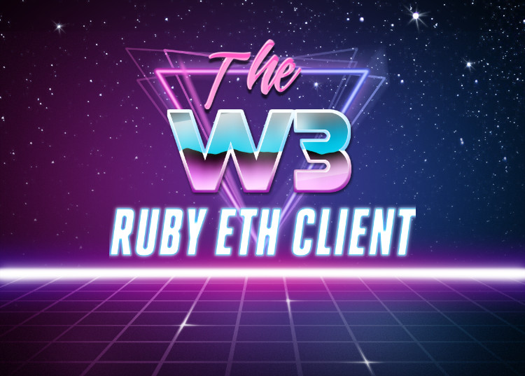

<p align="center">
  
</p>

# Intent

Blockchains are awesome, but developing dapps leaves a lot to be desired. I wanted to ease my pain with a language that was designed to make programmers happy.

ETH + Ruby = <3

## Keep it simple, stupid
The intent is not for this to be a one stop shop for all things Ethereum in Ruby. Rather this is meant to be json-rpc client for Ethereum. That's it. And other libraries can use this to build a dapp framework around it.

## Safety
The secret sauce of this library is the usage of the speculation gem. speculation is a port of clojure.spec, which you can read more about [here](https://github.com/english/speculation). w3 spec's out the [Ethereum types](https://github.com/ethereum/wiki/wiki/Ethereum-Contract-ABI). Giving type like safety to a dynamic programming language like Ruby! No more 'invalid args to Solidity' error messages and other nonsense.

There are other safety measures as well. This library ensures that getter methods should be called with 'eth_call' and setter methods should be called with 'eth_sendTransaction'.

Getters look like normal syntax:
```ruby
simple_storage.get
```

Setters use the bang to emphasize changing state and that you are spending precious ETH!!!
```ruby
simple_storage.set! 42, {"from" => accounts[0]}
```

## Installation

Ensure you have ruby and bundle installed. It is recommended you install ruby with rvm.

Install bundler: `gem install bundler`

Clone this repo
```
cd w3
bundle install
```

Ensure you have a blockchain that you can connect to. An easy development one is ganache-cli
`npm install -g ganache-cli`
In a separate tab run `ganache-cli`

Then to run the tests you can do:
```bash
rspec --format doc
```

You can run an example by ensuring you are in the root('w3') directory
```
ruby examples/*example*.rb
```

## Yet another Ethereum client for Ruby?
After looking at other solutions I didn't feel like the other Ethereum libraries only did the job of web3. They either combined the roles of truffle or etherscan, which I didn't feel like was appropriate for the intent of this library.

This was a fun chance to learn the internals of an Ethereum client and how to format the transaction messages.

Wanted to be in full control of my vision for what developing dapps in Ruby could be like. The vision of this library incorporates my experiences working with different languages. I want the Rust community's emphasis on safety because the blockchain space is scary and mistakes cost money. I want Clojure's expressiveness and minimal reliance on objects or classes. I figured I could possibly get both by using the `speculation` gem.

Huge shout out to [ethereum.rb](https://github.com/EthWorks/ethereum.rb) for guidance and inspiration.

Logo made with this [web tool](https://photofunia.com/categories/all_effects/retro-wave)

## The MIT License (MIT)

Copyright 2018 Harley Swick

Permission is hereby granted, free of charge, to any person obtaining a copy of this software and associated documentation files (the "Software"), to deal in the Software without restriction, including without limitation the rights to use, copy, modify, merge, publish, distribute, sublicense, and/or sell copies of the Software, and to permit persons to whom the Software is furnished to do so, subject to the following conditions:

The above copyright notice and this permission notice shall be included in all copies or substantial portions of the Software.

THE SOFTWARE IS PROVIDED "AS IS", WITHOUT WARRANTY OF ANY KIND, EXPRESS OR IMPLIED, INCLUDING BUT NOT LIMITED TO THE WARRANTIES OF MERCHANTABILITY, FITNESS FOR A PARTICULAR PURPOSE AND NONINFRINGEMENT. IN NO EVENT SHALL THE AUTHORS OR COPYRIGHT HOLDERS BE LIABLE FOR ANY CLAIM, DAMAGES OR OTHER LIABILITY, WHETHER IN AN ACTION OF CONTRACT, TORT OR OTHERWISE, ARISING FROM, OUT OF OR IN CONNECTION WITH THE SOFTWARE OR THE USE OR OTHER DEALINGS IN THE SOFTWARE.